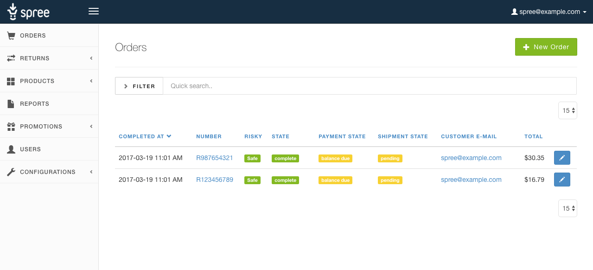

## Prerequisites

Before starting this tutorial, please check which Rails version are you using by running:

```bash
bundle exec rails -v
```

in your project root directory.

## Installation

1. Add Spree gems to your `Gemfile`

    **Rails 6.0 and 6.1**

    ```ruby
    gem 'spree', '~> 4.2.0.rc5'
    gem 'spree_auth_devise', '~> 4.3'
    gem 'spree_gateway', '~> 3.9'
    gem 'sassc', github: 'sass/sassc-ruby', branch: 'master'
    ```

    **Rails 5.2**

    ```ruby
    gem 'spree', '~> 3.7.0'
    gem 'spree_auth_devise', '~> 3.5'
    gem 'spree_gateway', '~> 3.4'
    ```

    **Rails 5.1**

    ```ruby
    gem 'spree', '~> 3.5.0'
    gem 'spree_auth_devise', '~> 3.3'
    gem 'spree_gateway', '~> 3.3'
    ```

    **Rails 5.0**

    ```ruby
    gem 'spree', '~> 3.2.0'
    gem 'spree_auth_devise', '~> 3.2.0'
    gem 'spree_gateway', '~> 3.2.0'
    ```

2. Install gems

    ```bash
    bundle install
    ```

    **Note**: if you run into `Bundler could not find compatible versions for gem "sprockets":` error message, please run

    ```bash
    bundle update
    ```

3. Use the install generators to set up Spree

    ```shell
    bundle exec rails g spree:install --user_class=Spree::User
    bundle exec rails g spree:auth:install
    bundle exec rails g spree_gateway:install
    ```

### Installation options

By default, the installation generator (`rails g spree:install`) will run
migrations as well as adding seed and sample data and will copy storefront data
for easy customization (if `spree_frontend` available). This can be disabled using

```shell
rails g spree:install --migrate=false --sample=false --seed=false --copy_storefront=false
```

You can always perform any of these steps later by using these commands.

```shell
bundle exec rake railties:install:migrations
bundle exec rails db:migrate
bundle exec rails db:seed
bundle exec rake spree_sample:load
bundle exec rails g spree:frontend:copy_storefront
```

### Headless installation (API-mode)

To use Spree in [API-only mode](https://guides.spreecommerce.org/api/overview/) you need to replace `spree` with `spree_api` in your project Gemfile. This will skip Storefront and Admin Panel. If you would want to include the Admin Panel please add `spree_backend` to your Gemfile.

### Mounting the Spree engine

When `rails g spree:install` is run inside an application, it will install Spree, mounting the `Spree::Core::Engine` component by inserting this line automatically 
into `config/routes.rb`:

```ruby
mount Spree::Core::Engine, at: '/'
```

By default, all Spree routes will be available at the root of your domain. For example, if your domain is `http://localhost:3000`, Spree’s `/products` URL will be available at `http://localhost:3000/products`.

You can customize this simply by changing the `:at` specification in `config/routes.rb` to be something else. For example, if you would like Spree to be mounted at `/shop`, you can write this:

```ruby
mount Spree::Core::Engine, at: `/shop`
```

The different parts of Spree (API, Admin) will be mounted there as well, eg. `http://localhost:3000/shop/admin`.

### Use your existing authentication

[Spree Auth Devise](https://github.com/spree/spree_auth_devise) is the default authentication that comes with Spree but you can swap it for your own, please [follow this guide](/developer/customization/authentication.html)

## Hello, Spree Commerce

You now have a functional Spree application after running only a few commands!

To see your application in action, open a browser window and navigate to [http://localhost:3000](http://localhost:3000). You should see the Spree default home page:


To stop the web server, hit Ctrl-C in the terminal window where it's running. In development mode, Spree does not generally require you to stop the server; changes you make in files will be automatically picked up by the server.

### Logging Into the Admin Panel

The next thing you'll probably want to do is to log into the admin interface.
Use your browser window to navigate to
[http://localhost:3000/admin](http://localhost:3000/admin). You can login with
the username `spree@example.com` and password `spree123`.

Upon successful authentication, you should see the admin screen:



Feel free to explore some of the Admin Panel features that Spree has to offer and to verify that your installation is working properly.

## Next steps

If you've followed the steps described in this tutorial, you should now have a fully functional Spree application up and running.

We recommend you should continue to [Customization section](/developer/customization/storefront.html) to learn how to modify and extend your Spree application.

To learn more about Spree internals please refer [Core section](/developer/core/orders.html).
