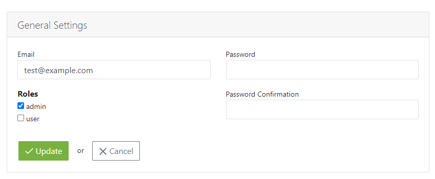

## Introduction

Roles are used to define user’s permissions on your website. This option gives you the ability to control the rights of users. By default, Spree offers two kinds of Roles: **Admin** and **User**. If you would like to make more roles with more specific features than the Admin and User roles, our company offers making those with the help of a little backend development work.
To open the **Roles** tab, extend the **Configuration** dropdown and find **Roles**.

## Creating a New Role

To create a new role, click the **New Role** button that is placed in the upper right corner of the page.

Simply input the name for the certain role and press the **Update** button.

When the role is created, you can still edit the name by pressing the **Edit** button.

You can also delete it by pressing the **Delete** button.

## Assigning a Role to a User

To assign a new Role, you need to open the editing panel for the certain User.

To find out more [click here](/user/users/editing_users.html).
